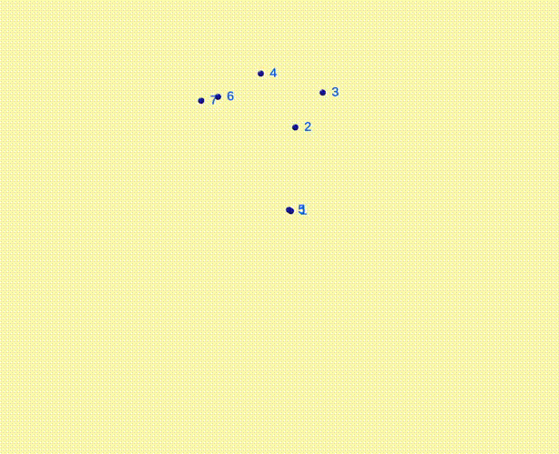

**Minimum Enclosing Ball Simulation Algorithm**

This repository contains an implementation of the simple streaming algorithm for computing the minimum enclosing ball (or 1-center) of a set of points in high dimensions, as described in the article "A Simple Streaming Algorithm for Minimum Enclosing Balls".

***Algorithm Overview***

The algorithm is designed to compute a 3/2-factor approximation of the minimum enclosing ball in any dimension using minimum space and processing the data points in just one pass.

***Simulation Results***

To visualize the algorithm's performance, we have created four GIF files:

These GIFs demonstrate the algorithm's behavior in 3D space:

***How to Run the Simulation***

To run the simulation, simply clone this repository and execute the project.

***Acknowledgments***

This implementation is based on the article "A Simple Streaming Algorithm for Minimum Enclosing Balls" and is intended for educational and research purposes only.

***License***

This repository is licensed under the MIT License. See the LICENSE file for details.

[A Simple Streaming Algorithm for Minimum Enclosing Balls](https://citeseerx.ist.psu.edu/document?repid=rep1&type=pdf&doi=11c10297de05dbac6ba1ac0ed25f212b08c0827a)
